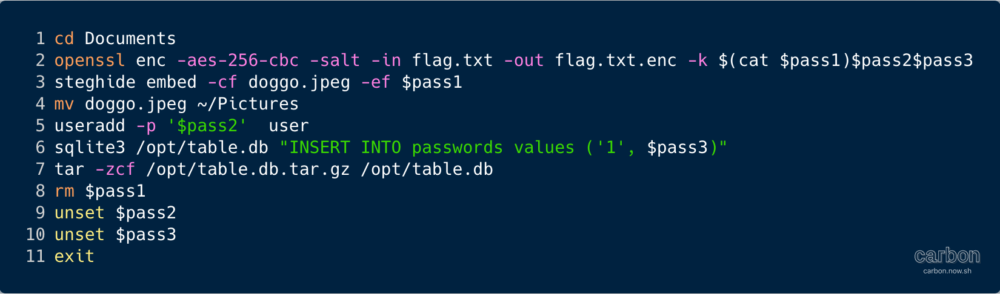
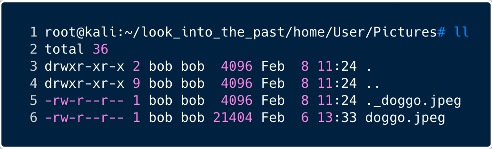

# Look into the past

April 27, 2020

**Task:** *We've captured a snapshot of a computer, but it seems the user was able to encrypt a file before we got to it. Can you figure out what they encrypted?*

In my opinion, this was one of the most interesting challences of this CTF as it was a mix of a few different sub-challenges to solve.

We were given a snapshop of a computer, in .tar format. After downloading it, we extracted its content:
```console
root@kali:~# tar xvf look_into_the_past.tar 
```

Sure enough, the archive contained a computer snapshot with most usual folders that we find on linux hosts:

```console
root@kali:~# ll look_into_the_past
total 80
drwxr-xr-x 20 bob  bob  4096 Feb  8 11:24 .
drwxr-xr-x  6 root root 4096 Apr 30 02:07 ..
drwxr-xr-x  2 bob  bob  4096 Feb  8 11:24 bin
drwxr-xr-x  2 bob  bob  4096 Feb  8 11:24 boot
drwxr-xr-x  8 bob  bob  4096 Feb  8 11:24 dev
drwxr-xr-x 97 bob  bob  4096 Feb  8 11:24 etc
drwxr-xr-x  3 bob  bob  4096 Feb  8 11:24 home
drwxr-xr-x  2 bob  bob  4096 Feb  8 11:24 lib
drwxr-xr-x  2 bob  bob  4096 Feb  8 11:24 media
drwxr-xr-x  2 bob  bob  4096 Feb  8 11:24 mnt
drwxr-xr-x  2 bob  bob  4096 Feb  8 11:24 opt
drwxr-xr-x  2 bob  bob  4096 Feb  8 11:24 proc
drwxr-xr-x  3 bob  bob  4096 Feb  8 11:24 root
drwxr-xr-x  2 bob  bob  4096 Feb  8 11:24 run
drwxr-xr-x  2 bob  bob  4096 Feb  8 11:24 sbin
drwxr-xr-x  2 bob  bob  4096 Feb  8 11:24 srv
drwxr-xr-x  2 bob  bob  4096 Feb  8 11:24 sys
drwxr-xr-x  2 bob  bob  4096 Feb  8 11:24 tmp
drwxr-xr-x 13 bob  bob  4096 Feb  8 11:24 usr
drwxr-xr-x  9 bob  bob  4096 Feb  8 11:24 var
```

Given the title of the challenge "Look into the past", we first thought that we should go check the logs, in `/var/log` but that folder was empty. So the next interesting place to check out was the `/home/` folder.

Bingo!

```console
root@kali:~/look_into_the_past/home/User# ll
total 52
drwxr-xr-x 9 bob bob 4096 Feb  8 11:24 .
drwxr-xr-x 3 bob bob 4096 Feb  8 11:24 ..
-rw-r--r-- 1 bob bob  349 Feb  6 13:33 .bash_history
-rw-r--r-- 1 bob bob  864 Feb  6 13:34 .bashrc
drwxr-xr-x 2 bob bob 4096 Feb  8 11:24 Desktop
drwxr-xr-x 2 bob bob 4096 Feb  8 11:52 Documents
drwxr-xr-x 2 bob bob 4096 Feb  8 11:24 Downloads
drwxr-xr-x 2 bob bob 4096 Feb  8 11:24 Music
drwxr-xr-x 2 bob bob 4096 Feb  8 11:24 Pictures
-rw-r--r-- 1 bob bob  672 Feb  6 13:34 .profile
drwxr-xr-x 2 bob bob 4096 Feb  8 11:24 Public
drwxr-xr-x 2 bob bob 4096 Feb  8 11:24 Videos
-rw-r--r-- 1 bob bob   37 Feb  6 13:33 .vimrc
```

We went through all of these folders and found that only **Documents** and **Pictures** were of interest.
Also, we checked the `.bash_history` file for any interesting information and found a few clues. Obviously, "Look into the past" meant to go check out the bash history. So let's look at that first.

## .bash_history

This is the full dump of what was in the `.bash_history` file:

```console
root@kali:~/look_into_the_past/home/User# more .bash_history 
```


As we can see, during this user's last bash session, at some point they:

* **Lines 1 & 2** went to the ~/Documents/ folder and encoded the file `flag.txt` with AES 256, with salt, and as a password, used a combination of 3 strings, `$pass1`, `$pass2`, and `$pass3`.
* **Lines 3 & 4** used `steghide` to embed `$pass1` into an image and then moved this image file to ~/Pictures
* **Line 5** created a user on this machine called `user` and assigned `$pass2` to this user.
* **Lines 6 & 7** inserted `$pass3` into the `passwords` table of a SQLite 3 database in the `/opt/` folder and then tar'd the file.
* **Line 8** cleaned up by deleting the file or folder `$pass1` and removed the 2 variables `$pass2` and `$pass2` from memory.

To decode the flag.txt file, we need to assemble the password by finding the values of `$pass1`, `$pass2`, and `$pass3`.

Let's start by `$pass1`.

## $pass1 - Steganography

The first part of the password has been encoded in an image and then moved to `~/Pictures/`, so let's have a look at what we find there.

In this folder, there was a picture of Doge, and a hidden previous version of the same image file:


This is what the image looked like, can you spot `$pass1` in there?


Of course you can't, it's embedded.

Let's dive deeper in the image file.

Just to be sure there's nothing weird going on, we ran `file` and `binwalk` on it to make sure it was a valid PNG file.

There were a few ways to find the hidden text.

We could use steghide as the original user did. In this case we simply needed to type this to examine the file:

```console
root@kali:~/look_into_the_past/home/User/Pictures# steghide info doggo.jpeg 
"doggo.jpeg":
  format: jpeg
  capacity: 1.2 KB
Try to get information about embedded data ? (y/n) y
Enter passphrase: 
  embedded file "steganopayload213658.txt":
    size: 11.0 Byte
    encrypted: rijndael-128, cbc
    compressed: yes
```

We found the embedded file that *should* contain the `$pass1` we're looking for. To extract that file:

```console
root@kali:~/look_into_the_past/home/User/Pictures# steghide extract -sf doggo.jpeg 
Enter passphrase: 
wrote extracted data to "steganopayload213658.txt".
```

Then a quick `cat` of the extracted file:
```console
root@kali:~/look_into_the_past/home/User/Pictures# cat steganopayload213658.txt 
JXrTLzijLb
```

And there you go! `$pass1` = `JXrTLzijLb`

Let's save this for later and now go hunting for `$pass2`.

For those interested, there were a few other ways to find this hidden text, of course.
One of them was to upload the image file in an online image decoder such as:


Actually, running the `strings` command on the backup of the image file, `._doggo.jpeg`, reveals this:
```console
root@kali:~/Downloads/introseccon/look_into_the_past/home/User/Pictures# strings ._doggo.jpeg 
Mac OS X        
ATTR;
com.apple.quarantine
com.apple.lastuseddate#PS
com.apple.macl
%com.apple.metadata:kMDItemWhereFroms
0083;5e3c53d6;Firefox;5EAD01A4-7C4C-451B-A64F-7461A0A651A9
bplist00
&https://futureboy.us/stegano/encode.pl_
*https://futureboy.us/stegano/encinput.html
This resource fork intentionally left blank   
```

So that was probably an intentional hint to help those who couldn't or wouldn't use `steghide`.

* * *

## $pass2 - New user


## Documents

```console
root@kali:~/look_into_the_past/home/User# ll Documents/
total 16
drwxr-xr-x 2 bob bob 4096 Feb  8 11:52 .
drwxr-xr-x 9 bob bob 4096 Feb  8 11:24 ..
-rw-r--r-- 1 bob bob   48 Feb  8 11:50 flag.txt.enc
-rw-r--r-- 1 bob bob   48 Feb  6 13:33 libssl-flag.txt.enc
root@kali:~/look_into_the_past/home/User# 
```

Hurray! There's our flag! Ok, so, obviously it's encoded and they're not going to make it easy for us to read that file.
Using the `File` command, we learned that both files were openssl encoded, with salt:

```console
root@kali:~/look_into_the_past/home/User/Documents# file *
flag.txt.enc:        openssl enc'd data with salted password
libssl-flag.txt.enc: openssl enc'd data with salted password
```

How are we going to decode this? We need to look for more clues.


So what do we do with images usually in CTFs? Of course we're tempted to search for hidden messages!
